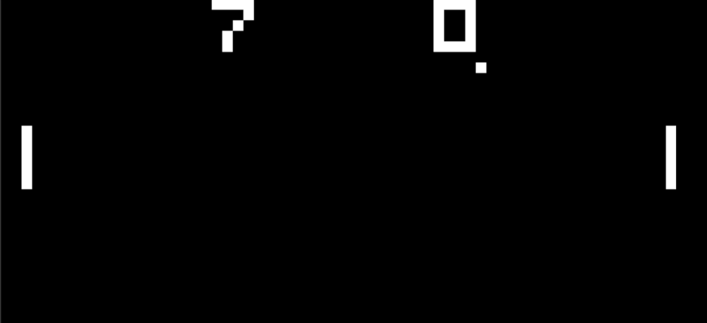

# CHIP-8 Emulator (C++ / SDL2)

A CHIP-8 emulator written in C++17 with SDL2 rendering and keyboard input.
Built from scratch, implementing the full CHIP-8 instruction set.

## Features
- Complete CHIP-8 CPU implementation
- 64×32 monochrome display (SDL2)
- Keyboard input mapped to CHIP-8 hex keypad
- Timers (delay & sound)
- Runs classic ROMs (PONG, etc.)

## Screenshots

The CHIP8 emulator running PONG.
## Build Instructions

### Requirements
- C++17 compiler
- SDL2
- CMake

### Build (Windows / MinGW)
```bash
mkdir build
cd build
cmake ..
cmake --build .
```
### Future Improvements
 - Implemented on physical hardware made with Raspberry PI Zero 2 W
 - Add speed up functionality
 - Add quick load and save states
 - Add audio

